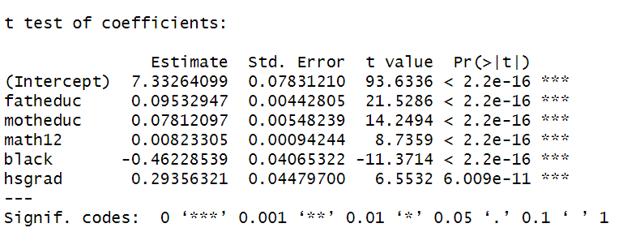

```{r setup, include=FALSE}
knitr::opts_chunk$set(echo = FALSE)
```

```{css, echo=FALSE}
.title_container {
  height: calc(25in*0.15);
}
```

# Introduction

In our project, we are delving into family incomes in the USA in 2005 using the 'catholic' package from Wooldridge. 
Our objective was to try to understand which factors would contribute to the increase or decrease of the families incomes, since this period in America was 
marked by significant socioeconomic disparities among Americans. This way we were able to see the bigger picture of society played a role in shaping the economy in this year.

# Research Question 

Our research question is: **"What variables will have a bigger impact on families' incomes?"**

# Methodology


 | Variables | DataType | Description                              | Range         |
  |-----------|----------|------------------------------------------|---------------|
  | read12    | Numeric  | Reading Standardized Score               | [28-70]       |
  | math12    | Numeric  | Mathematics Standardized Score           | [25-75]       |
  | black     | Binary   | =1 if Black                              | [0-1]         |
  | motheduc  | Numeric  | Mother's Years of Education              | [8-18]        |
  | fatheduc  | Numeric  | Father's Years of Education              | [8-18]        |
  | lfaminc   | Numeric  | Log of Family Income                     | [6-12.5]      |
  | hsgrad    | Binary   | =1 if Graduated from High School by 1994 | [0-1]        |
  
# Initial Regression

We did the summary function on the data set to understand better the data we were dealing with, and we found out that the variable ‘hsgrad’ had 1460 missing values, that’s 19.6% of the values. So, the first thing we did was fill the missing values with the mode of that variable.

  After that, we decided which variables would be more important for our research question, and ended up with these ones: fatheduc, motheduc, read12, math12, black, hsgrad. With these variables, we can analyze the education of both parents, their graduation and race. The only variable that got a p-value > 0.05 was ‘read12’ it´s considered not individually significant so we dropped it from the model.
  
  $$reg_{inicial} = lm~(lfaminc ~-~ fatheduc + motheduc $$
  $$ + math12  + black + hsgrad) $$ 

# Assumptions

 - **MLR1 - Linear in Parameters**: Verifies linearity between the parameters of the model.
  - **MLR2 - Random Sampling**: The dataset has 7430 random observations of 13 variables.
  - **MLR3 - No perfect collinearity**: In the sample, there are no exact linear relationships among the independent variables.
  - **MLR4 - Zero Conditional Mean**: There are no important variables omitted, so we can consider $(E [u_i | X] = 0)$.
  - **MLR5 - Homoskedacity**: To test the heteroskedasticity we did the Breuch-Pagan test, the White test, and the simple White test. In all the tests, we obtained a p-value less than 0.05, so the expected value belongs to the critical region, and we reject the null hypothesis. We can conclude that we have statistical evidence that we have heteroskedasticity in our model. Consequently, this model does not hold the Gauss-Markov theorem, therefore, the estimators are not BLUE, and the statistical inference is not valid. To help address issues related to heteroskedasticity and other violations of assumptions we did consider the robust errors.
  - **MLR6 - Normality**: To see the normality in our log-level model, we plot the graph with a line for normality distribution.

{width="100%"}

# Reset Test

To test the bad estimation of the model, we did the RESET test. We got a p-value of 0.009044, this value is less than 0.05, so we reject the null hypothesis and conclude that there is statistical evidence that the model have a bad estimation. This suggests that there may be omitted non-linearities in your model, indicating potential misspecification.

  $$lfaminc = 7.33 + 0.095fatheduc + 0.078motheduc $$
        $$  + 0.082math12 - 0.462black + 0.293hsgrad$$
        
# Conclusions

- Which variables influence the family income the most?
    - From our model, we can conclude that both father's education and mother's education have an impact of 9.5% and 7.8%, respectively, despite the reflection of gender disparity.
    - We also can see that race is still a crucial factor in family income, demonstrating that black people tend to have significantly lower family incomes compared to non-black people. If we increase the black population by 1 point, the family income will decrease by 46.2%, ceteris paribus.
    - Besides that, we also see that high school graduation substantially impacts family income, with an average increase of 29.3%. With this value, we can conclude that having education is extremely important for a better future as job salaries tend to increase when people have more education levels.

# References

<div style="text-align: left;">

1. [Statista - Median Household Income by Race in the U.S.](https://www.statista.com/statistics/1086359/median-household-income-race-us/)
2. [U.S. Census Bureau - Income Data](https://www2.census.gov/library/publications/2004/compendia/statab/124ed/tables/income.pdf)
3. [Statista - Average Weekly Income by Level of Education in the U.S.](https://www.statista.com/statistics/232946/average-weekly-income-by-level-of-education-in-the-us/)
4. [Wooldridge - Catholic School Data Description](http://fmwww.bc.edu/ec-p/data/wooldridge/catholic.des)
5. Wooldridge, J. M. (2015). *Introductory Econometrics - A Modern Approach*. Michigan: Michigan State University.